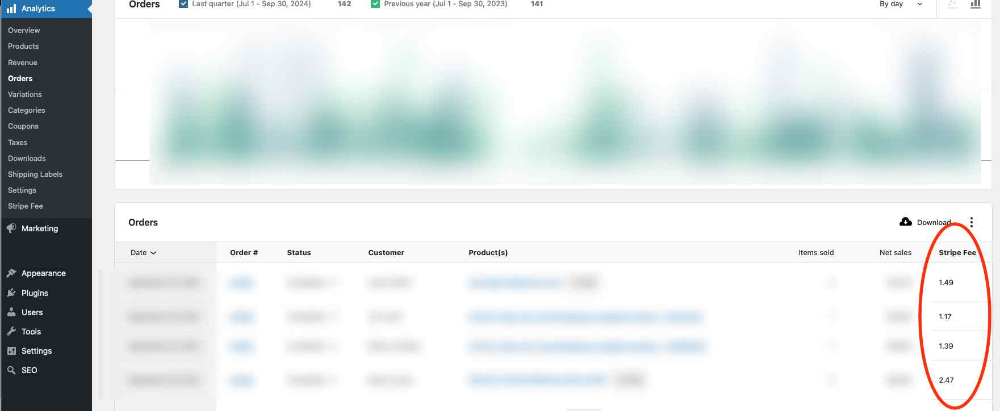

# Woocommerce Analytics Stripe Fees

A WooCommmerce Extension inspired by [Create Woo Extension](https://github.com/woocommerce/woocommerce/blob/trunk/packages/js/create-woo-extension/README.md).

This was created to help with quarterly and annual taxes.



## Getting Started

### Prerequisites

-   [NPM](https://www.npmjs.com/)
-   [Composer](https://getcomposer.org/download/)
-   [wp-env](https://developer.wordpress.org/block-editor/reference-guides/packages/packages-env/)

### Installation and Build

```
npm install
npm run build
npm start
```

### Building for Production

To create a distributable zip file for production use:

```
npm run plugin-zip
```

This will generate a `woocommerce-analytics-stripe-fees.zip` file in the plugin directory, ready for installation on any WordPress site via **Plugins > Add New > Upload Plugin**.

The zip file includes only the necessary files for production (built assets, PHP files, etc.) and excludes development files like `node_modules`, source files, and configuration files.

## References

* Updated the code after studying a Stackoverflow question: [try to add order item name column in woocommerce Analytics -> Orders report table (and output to csv file)](https://stackoverflow.com/questions/69560032/try-to-add-order-item-name-column-in-woocommerce-analytics-orders-report-tabl)
* Also available on an official blog post [Adding columns to analytics reports and CSV downloads](https://developer.woocommerce.com/2021/02/04/adding-columns-to-analytics-reports-and-csv-downloads/)
* Example of [how to extend WooCommerce Analytics](https://developer.woocommerce.com/docs/how-to-extend-woocommerce-analytics-reports/)

## TODO

* Dashboard > Analytics > Stripe Fee i.e. `/wp-admin/admin.php?page=wc-admin&path=%2Fanalytics%2Fwoocommerce-analytics-stripe-fee&period=last_quarter&compare=previous_year`
* Need to fix the error
* Determine what's most useful in here
* Add a way to show quarterly Stripe fees total
