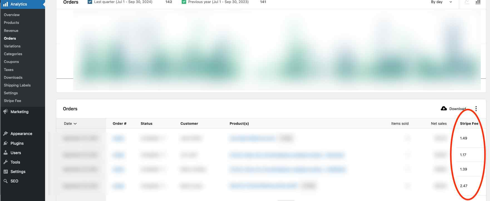

# Woocommerce Analytics Stripe Fees

Adds Stripe fee data to WooCommerce Analytics so fees are visible in report tables, charts, dashboard cards, and CSV exports.

This plugin reads the `_stripe_fee` order meta value written by WooCommerce Stripe integrations and adds:

-   `Stripe Fee` and `Net After Fees` columns to Analytics > Orders.
-   `Stripe Fees` and `Net After Fees` columns to Analytics > Revenue.
-   A `Stripe Fees` chart option for the Revenue report and Analytics dashboard.
-   Stripe fee values in Orders and Revenue CSV exports.



## Requirements

-   PHP 8.3 or newer.
-   WordPress 6.9 or newer.
-   WooCommerce 10.4 or newer.
-   Node.js 20.11.1 or newer for development builds.
-   Composer for PHP dependencies.

## Development

Install dependencies:

```bash
npm install
```

Build the admin script:

```bash
npm run build
```

Start the WordPress development environment:

```bash
npm start
```

The `postinstall` script runs `composer install`, so PHP dev dependencies are restored automatically after `npm install`.

## Quality Checks

Run the same checks used for release validation:

```bash
php -l woocommerce-analytics-stripe-fees.php
php -l includes/Admin/Setup.php
php -l includes/StripeFees.php
composer validate --strict
composer audit
./vendor/bin/phpunit --colors=never
npm run lint:js
npm run lint:css
npm run build
npm audit --audit-level=moderate
```

## Building a Release Zip

Create an installable plugin zip:

```bash
npm run plugin-zip
```

This generates `woocommerce-analytics-stripe-fees.zip` for upload through WordPress admin at Plugins > Add New > Upload Plugin.

The zip includes built assets, plugin PHP files, translations, the production Composer autoloader, and this README. Development-only files such as `src`, `tests`, `node_modules`, and PHPUnit dependencies are excluded.

The release script runs `composer install --no-dev --optimize-autoloader` before packaging, then restores development dependencies after the zip is created.

## Notes

Revenue report fees are calculated from WooCommerce orders across the report date range and grouped into the report intervals. The order query can be customized with the `woocommerce_analytics_stripe_fees_revenue_order_query_args` filter.

Currency display in the admin report columns uses WooCommerce's `wcSettings.currency` values when available.

## Changelog

See [CHANGELOG.md](CHANGELOG.md) for release history.

## References

-   [Adding columns to analytics reports and CSV downloads](https://developer.woocommerce.com/2021/02/04/adding-columns-to-analytics-reports-and-csv-downloads/)
-   [How to extend WooCommerce Analytics reports](https://developer.woocommerce.com/docs/how-to-extend-woocommerce-analytics-reports/)
-   [Create Woo Extension](https://github.com/woocommerce/woocommerce/blob/trunk/packages/js/create-woo-extension/README.md)

## License

Woocommerce Analytics Stripe Fees is licensed under the GNU General Public License v3.0 or later. See [LICENSE](LICENSE).
